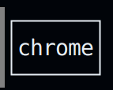
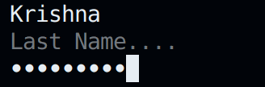
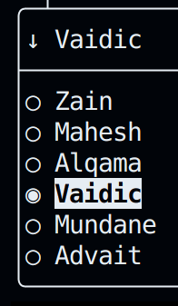
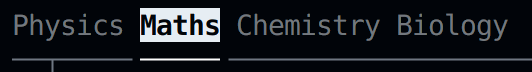
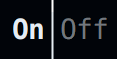
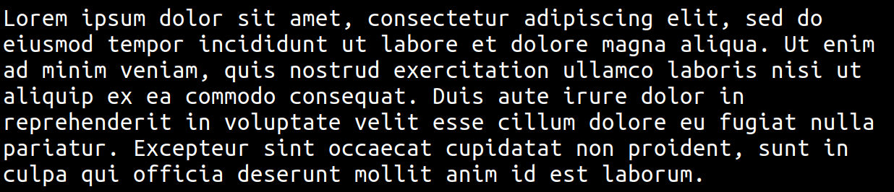
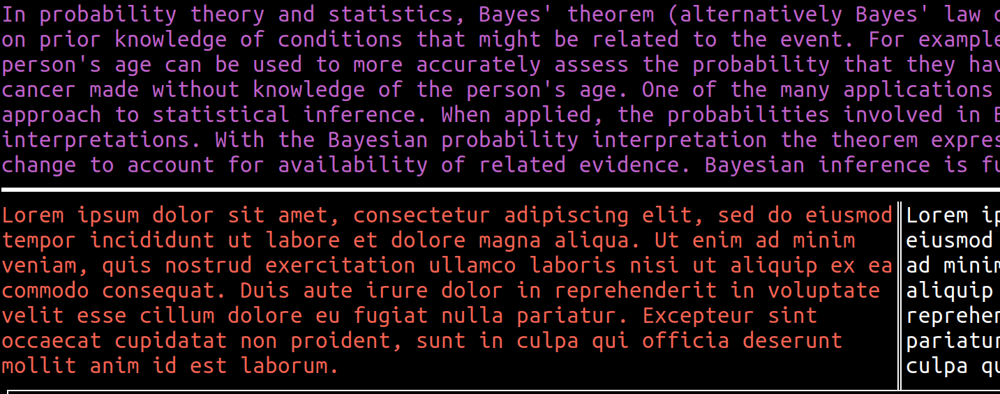
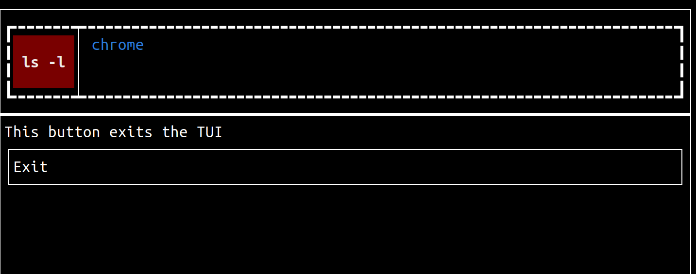
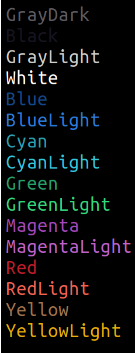

<div align="center">
    </img>
    <h1>Quick-FTXUI</h1>
    <h3>A <i>Quick</i> & Easy way to render terminal user interfaces, using FTXUI.</h3>
</div>

## Example

It converts this JSON-like [code](./examples/multiple_components.qf) into a TUI

```
DoubleBorder Vertical{
    str x
    Red underlined Text("This opens firefox")
    Blue Button{
        "Open firefox",
        System("/usr/bin/firefox"),
        Animated,
        x
    }
    Light separator
    int y = 20
    Yellow Slider {
        "A Slider: ",
        y,
        0,
        100,
        1
    }
    separator
    RoundedBorder Horizontal {
        int z = 1
        int w
        Red Dropdown {
            [ "Zain", "Mahesh", "Alqama", "Vaidic", "Mundane", "Advait", ],
            z
        }
        Cyan Toggle {
            [ "On", "Off", ],
            w
        }
    }

    Dashed separator

    RedLight Button {
        "Exit",
        "Exit",
        Ascii
    }
}
```

### Output

https://github.com/vrnimje/quick-ftxui/assets/103848930/715c821b-b259-4e2b-ab25-2484ad3c47c1

## Features
* #### Supports majority of FTXUI components, listed below:
    <details><summary>Button</summary>
    Supports System() calls (like /usr/bin/firefox)

    [Example](./examples/Button.qf)

    
    </details>

    <details><summary>Slider</summary>

    [Example](./examples/Slider.qf)

    

    </details>

    <details><summary>Input</summary>

    [Example](./examples/input.qf)

    

    </details>

    <details><summary>Dropdown</summary>

    [Example](./examples/menu_toggle_dropdown.qf#L15-L18)

    

    </details>

    <details><summary>Menu</summary>

    [Example](./examples/menu_toggle_dropdown.qf#L4-L8)
    
    

    </details>

    <details><summary>Toggle</summary>

    [Example](./examples/menu_toggle_dropdown.qf#L11-14)

    

    </details>

* #### Supports FTXUI's basic DOM elements (more coming with future releases)

    <details><summary>Text</summary>

    [Example](./examples/text.qf)

    

    </details>

    <details><summary>Paragraph</summary>

    Similar to text, but adapts to size of terminal windoe

    [Example](./examples/paragraph.qf)

    

    </details>

    <details><summary>Separators</summary>

    Allows for proper division the UI into neat sections

    [Example](./examples/separator.qf)

    

    </details>

    <details><summary>Borders</summary>
    
    Borders can be applied on a block level 

    [Example](./examples/border.qf)

    

    </details>

* #### Colours

    Quick-FTXUI supports FTXUI's 16 color pallete. Support for 256 color pallete coming soon

    [Example](./examples/colors.qf)

    

**Note:** To run the above examples, build this repository with the steps mentioned [here](#build-instructions)


* #### Variables

    Used as hooks, so that we can obtain the input given to the Terminal UI. Currently, supports `int` and `str` data types

    Check out the examples in [this directory](./examples/)

    **Note:** To run these examples, build this repository with the steps mentioned [here](#build-instructions)

* #### Embedded scripting supported in C++

    Supports basic scripting functionality, with functions (or hooks) to add & access the quick-ftxui variables. We can also use C++ references to integers and string data types to access the values inside the QF script. See the example given below. 
    
    [Full Example](./cpp_examples/example.cpp)

    ```cpp
    #include "quick-ftxui.hpp"
    #include <iostream>
    #include <string>

    using namespace std;
    using namespace quick_ftxui;

    int main() {
        int x = 5;
        string y = "Init value";
        set_int_var("x", &x);
        set_str_var("y", &y);
        string source_code = R"(Border Vertical{
                str z = "init"
                str a
                int o = 0
                Input {
                    "Type something...",
                    y
                }
                RedLight Slider {
                    "Test: ",
                    x,
                    0,
                    100,
                    2
                }
                Magenta Button{
                    "Chrome",
                    System("/usr/bin/google-chrome-stable"),
                    Animated,
                    z
                }
                Green Menu{
                    [ "Physics",  "Maths",  "Chemistry",  "Biology",],
                    VerticalAnimated,
                    o
                }
                Button {
                    "Exit",
                    "Exit"
                }
            })";

        parse_qf(source_code);

        cout << "Slider value is: " << x << "\n";
        cout << "User input is: " << y << "\n";
        cout << "Option no. selected in Menu is: " << get_int("o") + 1 << "\n";
        cout << "Chrome debug msgs are: " << get_str("z") << "\n";
    }
    ```

    **Note:** To run this example, build this repository with examples, steps [given here](#build-with-examples)

## Build instructions:
~~~bash
mkdir build
cd build
cmake .. -G "Ninja" -DQUICK_FTXUI_TESTS=ON
ninja
./quick-ftxui ../examples/Button.qf
~~~

## Build with examples:
~~~bash
mkdir build
cd build
cmake .. -G "Ninja" -DQUICK_FTXUI_EXAMPLES=ON
ninja
./cpp_examples/quick_ftxui_example
~~~

## Roadmap for v0.2 release

- [x] Adding color (component wise)
- [x] Adding FTXUI DOM elements (like seperator, border)
- [x] Adding a way to use C++ defined variables directly, instead of depending on script-variables 
- [ ] Adding detailed user documentation

## Dependencies

* [FTXUI](https://github.com/ArthurSonzogni/FTXUI), by [Arthur Sonzogni](https://github.com/ArthurSonzogni), for rendering the terminal graphics in backend
* [Boost Spirit](https://github.com/boostorg/spirit), for writing the parser for the custom language
* [Catch2](https://github.com/catchorg/Catch2), for unit tests

## Acknowledgements

* Special Thanks to [Shreyas Atre](https://github.com/SAtacker) and [Krishna Narayanan](https://github.com/Krishna-13-cyber) for their very crucial [foundational work](https://github.com/SAtacker/quick-ftxui) and guidance.
* Thanks to [Prit Kanadiya](https://github.com/PritK99) and [Khushi Balia](https://github.com/Khushi-Balia) for their contributions to the rest of the codebase
* Thanks to [Arthur Sonzogni](https://github.com/ArthurSonzogni) for his [FTXUI starter repository template](https://github.com/ArthurSonzogni/ftxui-starter), and his amazing FTXUI library 

## Disclaimer: This project is still in development phase, use it with caution. Future releases may break some functionality


